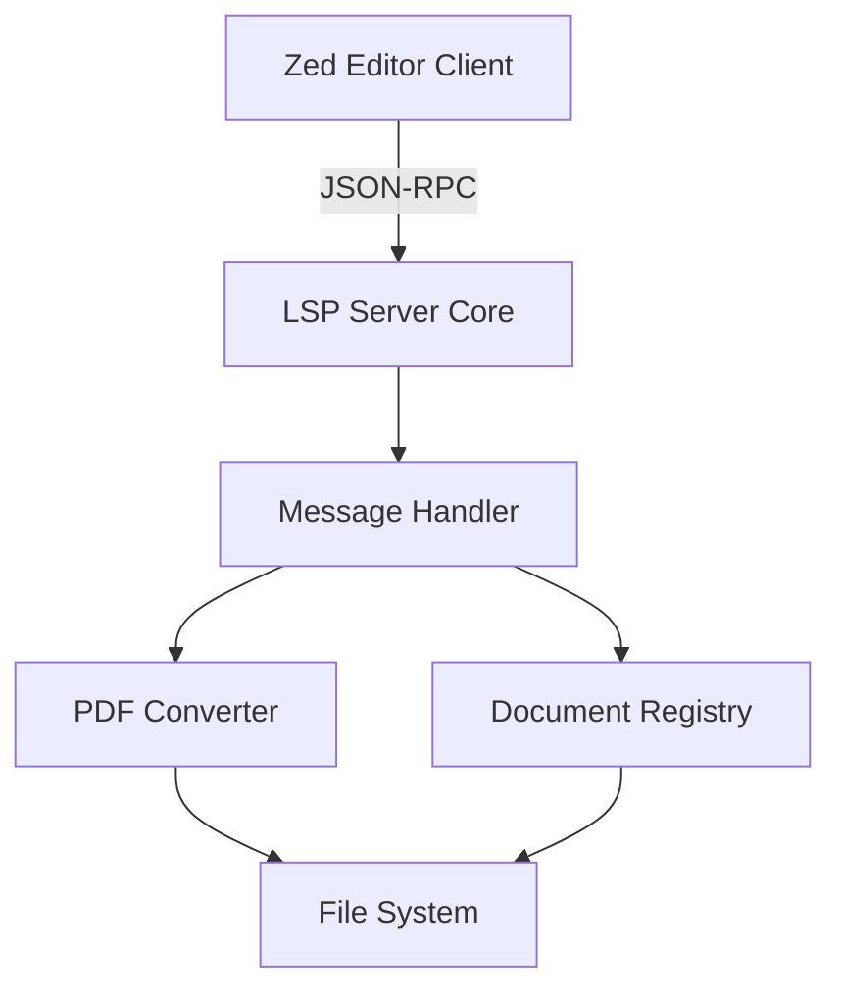
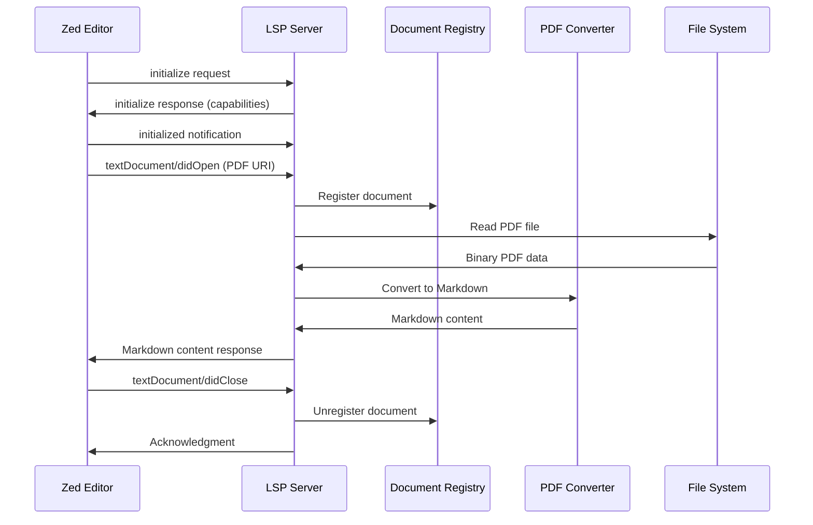

# Design Document: zed-pdf-lsp

## Overview

The zed-pdf-lsp is a Language Server Protocol (LSP) server that enables the Zed editor to display PDF files by converting them to Markdown format. The server acts as a bridge between Zed's LSP client and PDF files, treating PDFs as a specialized "language" that requires translation to a readable text format.

The system follows a client-server architecture where:
- Zed editor acts as the LSP client
- zed-pdf-lsp acts as the LSP server
- Communication occurs via JSON-RPC 2.0 over stdin/stdout
- PDF files are converted on-demand when opened

Key design goals:
- Full LSP protocol compliance for compatibility with Zed and other editors
- Fast conversion times (2-5 seconds depending on file size)
- Robust error handling for corrupted, encrypted, or malformed PDFs
- Efficient resource management for multiple concurrent documents
- Asynchronous processing to maintain responsiveness

## Architecture

### System Components



### Component Responsibilities

**LSP Server Core**
- Manages server lifecycle (initialize, shutdown, exit)
- Handles JSON-RPC message framing with Content-Length headers
- Routes incoming requests to appropriate handlers
- Manages stdin/stdout communication with Zed

**Message Handler**
- Implements LSP notification handlers (didOpen, didClose)
- Validates incoming LSP messages
- Formats outgoing responses according to LSP specification
- Logs all message traffic at debug level

**Document Registry**
- Maintains a map of currently open PDF documents
- Tracks document URIs and their associated state
- Provides resource cleanup on document close
- Ensures thread-safe access to document state

**PDF Converter**
- Extracts text content from PDF binary files
- Converts extracted text to Markdown format
- Preserves document structure (paragraphs, headings)
- Handles multi-page PDFs sequentially
- Detects and reports errors (corruption, encryption, empty content)

### Communication Flow



### Technology Stack

**Language**: Rust (recommended for performance, memory safety, and LSP ecosystem)

**Key Libraries**:
- `tower-lsp`: LSP server framework with async support
- `tokio`: Async runtime for non-blocking I/O
- `pdf-extract` or `lopdf`: PDF text extraction
- `serde_json`: JSON serialization for LSP messages
- `tracing`: Structured logging

Alternative language options: TypeScript (with `vscode-languageserver`), Python (with `pygls`)

## Components and Interfaces

### LSP Server Core

```rust
pub struct PdfLspServer {
    client: Client,
    document_registry: Arc<RwLock<DocumentRegistry>>,
    pdf_converter: Arc<PdfConverter>,
}

impl LanguageServer for PdfLspServer {
    async fn initialize(&self, params: InitializeParams) -> Result<InitializeResult>;
    async fn initialized(&self, params: InitializedParams);
    async fn shutdown(&self) -> Result<()>;
    async fn did_open(&self, params: DidOpenTextDocumentParams);
    async fn did_close(&self, params: DidCloseTextDocumentParams);
}
```

**Key Methods**:
- `initialize`: Returns server capabilities including document sync and PDF file extension support
- `did_open`: Triggers PDF conversion and content delivery
- `did_close`: Cleans up document resources
- `shutdown`: Prepares server for graceful termination

### Document Registry

```rust
pub struct DocumentRegistry {
    documents: HashMap<Url, DocumentState>,
}

pub struct DocumentState {
    uri: Url,
    opened_at: Instant,
    content_hash: Option<u64>,
}

impl DocumentRegistry {
    pub fn register(&mut self, uri: Url) -> Result<()>;
    pub fn unregister(&mut self, uri: &Url) -> Result<()>;
    pub fn is_open(&self, uri: &Url) -> bool;
    pub fn get_all_open(&self) -> Vec<Url>;
}
```

**Thread Safety**: Uses `Arc<RwLock<>>` for concurrent access from async tasks

### PDF Converter

```rust
pub struct PdfConverter {
    max_memory_mb: usize,
}

pub struct ConversionResult {
    pub content: String,
    pub page_count: usize,
    pub conversion_time_ms: u64,
}

impl PdfConverter {
    pub async fn convert_to_markdown(&self, pdf_path: &Path) -> Result<ConversionResult, ConversionError>;
    fn extract_text(&self, pdf_data: &[u8]) -> Result<Vec<String>>;
    fn format_as_markdown(&self, pages: Vec<String>) -> String;
    fn detect_headings(&self, text: &str) -> Vec<(usize, String)>;
}

pub enum ConversionError {
    FileNotFound(PathBuf),
    FileNotReadable(PathBuf),
    CorruptedPdf(String),
    EncryptedPdf,
    EmptyPdf,
    MemoryLimitExceeded,
}
```

**Conversion Strategy**:
1. Read PDF binary data from file system
2. Extract text page-by-page using PDF library
3. Detect structural elements (headings based on font size/style)
4. Format as Markdown with page separators
5. Return complete Markdown string

### Message Handler

```rust
pub struct MessageHandler {
    logger: Logger,
}

impl MessageHandler {
    pub fn log_request(&self, method: &str, params: &serde_json::Value);
    pub fn log_response(&self, method: &str, result: &serde_json::Value);
    pub fn format_error_response(&self, error: ConversionError) -> String;
}
```

## Data Models

### LSP Message Types

**Initialize Request**:
```json
{
  "jsonrpc": "2.0",
  "id": 1,
  "method": "initialize",
  "params": {
    "capabilities": {},
    "rootUri": "file:///workspace"
  }
}
```

**Initialize Response**:
```json
{
  "jsonrpc": "2.0",
  "id": 1,
  "result": {
    "capabilities": {
      "textDocumentSync": {
        "openClose": true,
        "change": 0
      }
    },
    "serverInfo": {
      "name": "zed-pdf-lsp",
      "version": "0.1.0"
    }
  }
}
```

**didOpen Notification**:
```json
{
  "jsonrpc": "2.0",
  "method": "textDocument/didOpen",
  "params": {
    "textDocument": {
      "uri": "file:///path/to/document.pdf",
      "languageId": "pdf",
      "version": 1,
      "text": ""
    }
  }
}
```

**didClose Notification**:
```json
{
  "jsonrpc": "2.0",
  "method": "textDocument/didClose",
  "params": {
    "textDocument": {
      "uri": "file:///path/to/document.pdf"
    }
  }
}
```

### Internal Data Structures

**Document State**:
- `uri`: Document URI (file path)
- `opened_at`: Timestamp when document was opened
- `content_hash`: Optional hash of converted content for caching

**Conversion Result**:
- `content`: Markdown-formatted text
- `page_count`: Number of pages processed
- `conversion_time_ms`: Time taken for conversion

### Markdown Output Format

```markdown
# Document Title (if detectable)

## Page 1

[Extracted text from page 1, preserving paragraphs]

---

## Page 2

[Extracted text from page 2, preserving paragraphs]

---

[Continue for all pages...]
```

**Error Message Format** (when conversion fails):
```markdown
# Error: Unable to Open PDF

**File**: /path/to/document.pdf

**Reason**: The PDF file is encrypted and requires a password.

Please decrypt the PDF file before opening it in Zed.
```


## Correctness Properties

*A property is a characteristic or behavior that should hold true across all valid executions of a system—essentially, a formal statement about what the system should do. Properties serve as the bridge between human-readable specifications and machine-verifiable correctness guarantees.*

### Property 1: Initialize Response Contains Required Capabilities

*For any* initialize request, the server response SHALL contain a capabilities object with textDocumentSync settings including openClose support.

**Validates: Requirements 1.1**

### Property 2: Initialization Error Responses Include Descriptive Messages

*For any* invalid initialize request that causes an error, the error response SHALL contain a non-empty message field describing the failure.

**Validates: Requirements 1.4**

### Property 3: PDF URI Acceptance

*For any* URI ending with the ".pdf" extension, the textDocument/didOpen handler SHALL accept the request without rejecting it based on file extension.

**Validates: Requirements 2.1**

### Property 4: File Reading Attempt

*For any* valid PDF file path provided in didOpen, the server SHALL attempt to read the file from the file system (verifiable through conversion results or error messages).

**Validates: Requirements 2.2**

### Property 5: Error Handling Returns Markdown Messages

*For any* error condition (missing file, unreadable file, corrupted PDF, encrypted PDF), the server SHALL return content formatted as valid Markdown containing an error description.

**Validates: Requirements 2.3, 2.4, 6.2, 6.3**

### Property 6: Text Extraction from Valid PDFs

*For any* valid PDF file containing extractable text, the converter SHALL produce non-empty Markdown content.

**Validates: Requirements 3.1**

### Property 7: Markdown Output Validity

*For any* PDF conversion result, the output SHALL be valid Markdown syntax that can be parsed without errors.

**Validates: Requirements 3.2**

### Property 8: Paragraph Structure Preservation

*For any* PDF with identifiable paragraph breaks, the converted Markdown SHALL contain corresponding paragraph separations (blank lines or structural elements).

**Validates: Requirements 3.3**

### Property 9: Heading Detection and Conversion

*For any* PDF containing detectable headings (based on font size or style), the converter SHALL represent them using Markdown heading syntax (# or ##).

**Validates: Requirements 3.4**

### Property 10: Multi-Page Content Extraction

*For any* PDF with N pages (where N > 1), the converted Markdown SHALL contain content from all N pages in sequential order.

**Validates: Requirements 3.5**

### Property 11: UTF-8 Encoding Validity

*For any* Markdown content produced by the converter, the text SHALL be valid UTF-8 encoded data without encoding errors.

**Validates: Requirements 4.4**

### Property 12: JSON-RPC 2.0 Message Format

*For any* message sent by the server, it SHALL conform to the JSON-RPC 2.0 specification with proper jsonrpc, id (for responses), and method/result fields.

**Validates: Requirements 5.1, 4.2**

### Property 13: Content-Length Header Presence

*For any* message sent by the server, it SHALL be prefixed with a Content-Length header indicating the byte length of the JSON payload.

**Validates: Requirements 5.4**

### Property 14: Shutdown Response Format

*For any* shutdown request, the server SHALL respond with a result value of null.

**Validates: Requirements 5.5**

### Property 15: Error Logging Includes Context

*For any* error during PDF processing, the log entry SHALL contain both the Document_URI and error details.

**Validates: Requirements 6.1**

### Property 16: Bidirectional Message Logging

*For any* LSP message (incoming request or outgoing response), a debug-level log entry SHALL be created.

**Validates: Requirements 6.4, 6.5**

### Property 17: Conversion Time Performance

*For any* PDF file, if the file size is less than 10MB, conversion SHALL complete within 2 seconds; if the file size is 10MB or greater, conversion SHALL complete within 5 seconds.

**Validates: Requirements 7.1, 7.2**

### Property 18: Asynchronous Non-Blocking Processing

*For any* two concurrent PDF conversion requests, processing one SHALL NOT block the other from starting or completing.

**Validates: Requirements 7.3**

### Property 19: Memory Usage Limit

*For any* single PDF conversion operation, peak memory usage SHALL NOT exceed 500MB.

**Validates: Requirements 7.4**

### Property 20: Resource Cleanup on Close

*For any* document that is opened and then closed, all associated resources (memory, file handles) SHALL be released after the didClose notification is processed.

**Validates: Requirements 8.1**

### Property 21: Registry Removal Timing

*For any* document close operation, the document SHALL be removed from the registry within 100ms of receiving the didClose notification.

**Validates: Requirements 8.3**

### Property 22: Concurrent Document Handling

*For any* set of N PDF documents (where N > 1) opened simultaneously, the server SHALL successfully process and maintain state for all N documents without interference.

**Validates: Requirements 8.2, 8.4**


## Error Handling

### Error Categories

**1. File System Errors**
- File not found
- File not readable (permissions)
- Invalid file path

**Strategy**: Return Markdown-formatted error message to editor, log error with full context

**2. PDF Processing Errors**
- Corrupted PDF structure
- Encrypted/password-protected PDF
- Unsupported PDF version
- Empty or image-only PDF

**Strategy**: Attempt graceful degradation, return descriptive error message in Markdown format

**3. Protocol Errors**
- Malformed JSON-RPC messages
- Invalid LSP method calls
- Missing required parameters

**Strategy**: Return JSON-RPC error response with appropriate error code, log at warning level

**4. Resource Errors**
- Memory limit exceeded
- Timeout during conversion
- Too many concurrent operations

**Strategy**: Cancel operation, return error message, ensure cleanup of partial state

### Error Response Format

All errors returned to the editor follow this Markdown template:

```markdown
# Error: [Error Type]

**File**: [Document URI]

**Reason**: [Detailed explanation]

[Suggested action or workaround]
```

### Logging Strategy

**Log Levels**:
- `ERROR`: File system failures, PDF processing failures, resource exhaustion
- `WARN`: Protocol violations, deprecated features
- `INFO`: Server lifecycle events (start, shutdown), document open/close
- `DEBUG`: All LSP messages, conversion timing, registry operations
- `TRACE`: Detailed PDF parsing steps, memory allocations

**Log Format**:
```
[timestamp] [level] [component] message key=value key=value
```

Example:
```
2024-01-15T10:30:45Z INFO lsp_server Server initialized version=0.1.0
2024-01-15T10:30:50Z DEBUG message_handler Received request method=textDocument/didOpen uri=file:///doc.pdf
2024-01-15T10:30:52Z INFO pdf_converter Conversion complete uri=file:///doc.pdf pages=5 duration_ms=1850
```

### Recovery Mechanisms

**Partial Conversion Failure**: If some pages fail to extract, include error markers in Markdown output and continue with remaining pages

**Memory Pressure**: Implement streaming conversion for large PDFs, processing pages incrementally

**Timeout Handling**: Set 10-second timeout per conversion, return partial results if available

## Testing Strategy

### Overview

The testing strategy employs a dual approach combining unit tests for specific scenarios and property-based tests for comprehensive coverage of the correctness properties defined in this document.

### Unit Testing

**Purpose**: Verify specific examples, edge cases, and integration points

**Framework**: `cargo test` (Rust standard testing) with `tokio::test` for async tests

**Test Categories**:

1. **LSP Protocol Compliance**
   - Initialize handshake with valid parameters
   - Shutdown sequence (shutdown → exit)
   - Message framing with Content-Length headers
   - JSON-RPC 2.0 format validation

2. **PDF Conversion Examples**
   - Single-page PDF with simple text
   - Multi-page PDF with headings
   - PDF with special characters (Unicode)
   - Empty PDF (no text content)
   - Image-only PDF

3. **Error Conditions**
   - Non-existent file path
   - Corrupted PDF file
   - Encrypted PDF file
   - File permission errors
   - Invalid URI formats

4. **Document Lifecycle**
   - Open → Close sequence
   - Multiple documents open simultaneously
   - Close non-existent document (error case)

5. **Integration Tests**
   - Full LSP client-server interaction
   - End-to-end conversion workflow
   - Concurrent document handling

**Unit Test Balance**: Focus on concrete examples and edge cases. Avoid writing exhaustive unit tests for input variations—property-based tests handle comprehensive input coverage.

### Property-Based Testing

**Purpose**: Verify universal properties hold across all inputs through randomized testing

**Framework**: `proptest` (Rust property testing library)

**Configuration**:
- Minimum 100 iterations per property test
- Each test tagged with reference to design document property
- Tag format: `// Feature: zed-pdf-lsp, Property N: [property description]`

**Property Test Implementation**:

Each correctness property from the design document SHALL be implemented as a single property-based test. Examples:

```rust
#[proptest]
// Feature: zed-pdf-lsp, Property 3: PDF URI Acceptance
fn test_pdf_uri_acceptance(
    #[strategy(pdf_uri_strategy())] uri: String
) {
    let result = server.handle_did_open(uri);
    prop_assert!(result.is_ok());
}

#[proptest]
// Feature: zed-pdf-lsp, Property 7: Markdown Output Validity
fn test_markdown_validity(
    #[strategy(valid_pdf_strategy())] pdf_data: Vec<u8>
) {
    let markdown = converter.convert(pdf_data)?;
    prop_assert!(is_valid_markdown(&markdown));
}

#[proptest]
// Feature: zed-pdf-lsp, Property 17: Conversion Time Performance
fn test_conversion_performance(
    #[strategy(pdf_with_size_strategy())] pdf: (Vec<u8>, usize)
) {
    let (data, size_mb) = pdf;
    let start = Instant::now();
    let _ = converter.convert(data)?;
    let duration = start.elapsed();
    
    let max_duration = if size_mb < 10 {
        Duration::from_secs(2)
    } else {
        Duration::from_secs(5)
    };
    
    prop_assert!(duration <= max_duration);
}
```

**Custom Generators**:
- `pdf_uri_strategy()`: Generates valid file URIs ending in .pdf
- `valid_pdf_strategy()`: Generates structurally valid PDF files
- `pdf_with_size_strategy()`: Generates PDFs of specific sizes
- `corrupted_pdf_strategy()`: Generates malformed PDF data
- `multi_page_pdf_strategy()`: Generates PDFs with varying page counts

### Performance Testing

**Benchmarks** (using `criterion` crate):
- Conversion time vs. file size
- Memory usage vs. file size
- Concurrent document handling throughput
- Registry operation latency

**Performance Targets**:
- < 2s for PDFs under 10MB
- < 5s for PDFs over 10MB
- < 100ms for registry operations
- < 500MB memory per conversion

### Test Coverage Goals

- Line coverage: > 80%
- Branch coverage: > 75%
- All 22 correctness properties: 100% (each property has a corresponding property test)
- All error paths: 100% (covered by unit tests)

### Continuous Integration

**CI Pipeline**:
1. Run all unit tests
2. Run all property tests (100 iterations each)
3. Run integration tests
4. Generate coverage report
5. Run performance benchmarks (on main branch only)
6. Lint and format checks

**Test Execution Time Target**: < 5 minutes for full test suite

